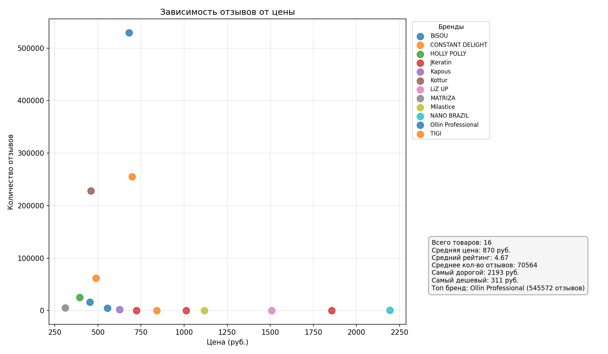

# Анализ рынка несмываемых средств для волос на Wildberries

Учебный проект для портфолио. Анализировала категорию уходовой косметики (спреи, кремы, масла) на Wildberries.

## Что сделано

- Собраны данные по 16 товарам (вручную из карточек WB)
- Посчитала среднюю цену, рейтинг, топ брендов по отзывам
- Нашла лидера рынка — бренд Ollin Professional (более 545 тыс. отзывов)
- Построила график зависимости количества отзывов от цены
- Код на Python с pandas, matplotlib, mplcursors

## Основные цифры

| Показатель | Значение |
|------------|----------|
| Всего товаров | 16 |
| Средняя цена | 870 руб. |
| Средний рейтинг | 4.67 |
| Самый дорогой товар | 2 193 руб. (NANO BRAZIL) |
| Самый дешёвый товар | 311 руб. (MATRIZA) |
| Лидер по отзывам | Ollin Professional (545 572 отзыва) |

## Что заметила

Дорогие товары (дороже 1500 руб.) имеют значительно меньше отзывов, чем товары в среднем ценовом сегменте. Это значит, что премиум-ниша слабо занята — потенциальная возможность для вывода нового продукта.

## Инструменты

- Python: pandas, matplotlib, mplcursors, requests, re, time
- Данные: Excel (xlsx)
- Среда: Windows, терминал (CMD)

## Файлы в репозитории

- `wb_products.xlsx` — исходные данные (16 товаров)
- `03_analiz.py` — скрипт для анализа и графика
- `01_get_product.py` — скрипт для парсинга через API
- `analiz_nesmyvashki.png` — итоговый график

## Как запустить

Установить зависимости и запустить скрипт:

```bash
pip install pandas matplotlib openpyxl mplcursors requests
python 03_analiz.py
```

## Ссылка на график



 [Скачать PDF-отчёт с анализом](analiz_report.pdf)
